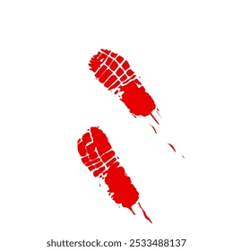

# Case Study: Issue #360 - Add Bloody Footprints

## Issue Summary

**Issue URL:** https://github.com/Jhon-Crow/godot-topdown-MVP/issues/360

**Problem Description (Russian):**
> если враг или игрок вступает в лужу крови за ними должны появляться кровавые следы ботинок, которые будут всё прозрачнее с каждым шагом, пока не исчезнут.
> они не должно исчезать со временим, их максимально количество не ограничено.

**English Translation:**
> If an enemy or player steps into a blood puddle, bloody boot footprints should appear behind them, which will become more transparent with each step until they disappear.
> They should NOT disappear over time, their maximum number is NOT limited.

## Requirements Analysis

### Core Requirements

1. **Blood Puddle Detection**: Detect when player or enemy steps into a blood puddle
2. **Footprint Spawning**: Spawn footprint decals behind the character while they have "bloody feet"
3. **Fading Transparency**: Each consecutive footprint should be more transparent than the previous
4. **Persistence**: Footprints do NOT fade over time - they persist indefinitely
5. **Unlimited Count**: No maximum limit on footprints (performance considerations still apply)
6. **Both Characters**: Feature applies to both player and enemies

### Key Behaviors

- Footprints appear **after** stepping into blood (tracking blood outward)
- Transparency decreases step-by-step (e.g., 100% → 80% → 60% → 40% → 20% → 0%)
- The number of "bloody steps" before footprints stop is configurable
- Footprints should rotate to match character's movement direction

## Technical Research

### Existing Codebase Analysis

#### Blood System Components

1. **BloodDecal.tscn** (`scenes/effects/BloodDecal.tscn`)
   - Sprite2D-based blood stain effect
   - Uses GradientTexture2D (32x32 radial gradient)
   - Has optional auto_fade functionality (disabled by default)
   - Script: `scripts/effects/blood_decal.gd`

2. **BloodEffect.tscn** (`scenes/effects/BloodEffect.tscn`)
   - GPUParticles2D blood spray effect
   - Spawns BloodDecal instances at particle landing positions
   - Uses `effect_cleanup.gd` script

3. **ImpactEffectsManager** (`scripts/autoload/impact_effects_manager.gd`)
   - Autoload singleton managing all impact effects
   - Spawns blood decals via `spawn_blood_effect()`
   - Has `MAX_BLOOD_DECALS: int = 100` limit (but footprints should be unlimited per requirements)
   - Already handles blood puddle spawning at hit locations

#### Character Movement Systems

1. **Player** (`scripts/characters/player.gd`)
   - CharacterBody2D-based movement
   - Uses `_physics_process()` for movement via `move_and_slide()`
   - Has velocity tracking for movement direction
   - Walking animation system exists (`_update_walk_animation()`)

2. **Enemy** (`scripts/objects/enemy.gd`)
   - CharacterBody2D-based movement with AI states
   - Uses NavigationAgent2D for pathfinding
   - Walking animation system exists

### External Research

#### Godot Implementation Approaches

1. **Trail Effect with Line2D** ([DEV Community](https://dev.to/gauravk_/how-to-create-trail-effect-in-godot-engine-49mo))
   - Uses Line2D node for drawing trails
   - Not ideal for discrete footprints

2. **Particle-based Trails** ([Godot Shaders](https://godotshaders.com/shader/particle-based-trail/))
   - GPU-efficient for continuous trails
   - Overkill for discrete footprint spawning

3. **Sprite2D with Tween Fading** ([Godot Forum](https://forum.godotengine.org/t/persistent-decals-2d/32011))
   - Most appropriate for this use case
   - Each footprint is a Sprite2D instance
   - Alpha value set at spawn time (no animation needed per requirements)

#### Game Development Best Practices

1. **Polygon Treehouse's Footprint System** ([Blog](https://www.polygon-treehouse.com/blog/2018/3/29/footprints-are-go))
   - Uses animation events to trigger footprints at foot landing
   - Fades footprints over time (we don't need this)
   - Limits footprint count for performance (we need unlimited)

2. **Blood Trail FX Asset** ([Realtime VFX Store](https://realtimevfxstore.com/products/blood-trail-fx))
   - Commercial asset with bloody footprints
   - Shows that footprints should be textured (boot shape)
   - Frequency of spawning is adjustable

### Available Libraries/Components

1. **DecalCo Plugin** ([GitHub](https://github.com/Master-J/DecalCo))
   - Shader-based decal solution for Godot 3.x
   - Not compatible with Godot 4.x directly

2. **GPUTrail Plugin** ([GitHub](https://github.com/celyk/GPUTrail))
   - GPU-based trail for Godot 4
   - Better for continuous trails, not discrete footprints

## Proposed Solutions

### Solution 1: Component-Based Footprint Manager (Recommended)

**Architecture:**
```
BloodyFeetComponent (Node)
├── Tracks "blood level" (decreases with each step)
├── Detects blood puddle entry via Area2D overlap
├── Spawns footprint decals at step intervals
└── Attached to Player and Enemy nodes

FootprintDecal (Sprite2D scene)
├── boot-shaped texture
├── z_index = -1 (below characters)
├── rotation matches movement direction
└── modulate.a set at spawn time (no fade animation)

BloodyFeetManager (Autoload)
├── Preloads footprint scene
├── Tracks all footprints (for scene cleanup)
└── Handles footprint spawning requests
```

**Pros:**
- Clean separation of concerns
- Reusable component for any character
- Integrates with existing ImpactEffectsManager pattern
- Easy to test

**Cons:**
- Requires new component class
- Needs to hook into character movement

### Solution 2: Extend Existing Blood Decal System

**Architecture:**
- Add Area2D to BloodDecal for collision detection
- Add `bloody_feet` tracking directly to Player/Enemy scripts
- Spawn footprints from character scripts

**Pros:**
- Uses existing infrastructure
- Minimal new code

**Cons:**
- Clutters character scripts
- Less reusable
- Harder to maintain

### Solution 3: Signal-Based Event System

**Architecture:**
- Blood puddles emit `entered` signal
- Characters subscribe and set internal state
- Characters emit `step_taken` signal with position/direction
- BloodyFeetManager listens and spawns footprints

**Pros:**
- Fully decoupled
- Very testable
- Event-driven

**Cons:**
- More complex signal wiring
- May have performance overhead from many signals

## Recommended Approach

**Solution 1 (Component-Based)** is recommended because:

1. Follows existing project patterns (components like HealthComponent, VisionComponent)
2. Easy to attach to both Player and Enemy
3. Self-contained logic
4. Can integrate with existing ImpactEffectsManager for decal management
5. Testable in isolation

## Implementation Plan

### Phase 1: Create Footprint Assets
1. Create `footprint.png` texture (boot-shaped, grayscale for tinting)
2. Create `BloodFootprint.tscn` scene (Sprite2D with script)

### Phase 2: Implement Core System
1. Create `BloodyFeetComponent` component
2. Implement blood puddle detection (Area2D overlap)
3. Implement step tracking (distance-based or animation-event)
4. Implement footprint spawning with decreasing alpha

### Phase 3: Integration
1. Add component to Player scene
2. Add component to Enemy scene
3. Make blood decals detectable as "puddles"

### Phase 4: Testing
1. Unit tests for BloodyFeetComponent
2. Integration tests for footprint spawning
3. Manual gameplay testing

## Technical Specifications

### BloodyFeetComponent Properties

| Property | Type | Default | Description |
|----------|------|---------|-------------|
| `blood_steps_count` | int | 6 | Number of bloody footprints before clean |
| `step_distance` | float | 30.0 | Distance between footprint spawns (pixels) |
| `initial_alpha` | float | 0.8 | Alpha of first footprint |
| `alpha_decay_rate` | float | 0.15 | Alpha reduction per step |

### Footprint Decal Properties

| Property | Type | Default | Description |
|----------|------|---------|-------------|
| `z_index` | int | -1 | Below characters |
| `modulate.a` | float | varies | Set at spawn time |
| `rotation` | float | varies | Matches movement direction |
| `scale` | Vector2 | (0.5, 0.5) | Size of footprint |

### Blood Detection

Blood puddles need Area2D collision to be detected. Options:
1. Add Area2D child to BloodDecal scene
2. Use collision layer/mask for "blood" (new layer 7?)
3. Group-based detection ("blood_puddle" group)

## Files to Create/Modify

### New Files
- `scenes/effects/BloodFootprint.tscn` - Footprint decal scene
- `scripts/effects/blood_footprint.gd` - Footprint script
- `scripts/components/bloody_feet_component.gd` - Main component
- `tests/unit/test_bloody_feet_component.gd` - Unit tests
- `assets/sprites/effects/footprint.png` - Boot texture (or generate procedurally)

### Modified Files
- `scenes/effects/BloodDecal.tscn` - Add Area2D for detection
- `scripts/effects/blood_decal.gd` - Add group membership
- `scenes/characters/Player.tscn` - Add BloodyFeetComponent (GDScript version)
- `scenes/characters/csharp/Player.tscn` - Add BloodyFeetComponent (C# version)
- `scenes/objects/Enemy.tscn` - Add BloodyFeetComponent

---

## Debugging Session #2 (2026-01-25)

### Problem Report

User reported "не вижу изменений" (I don't see changes) and "проверь C#" (check C#).

The initial implementation was deployed but footprints were not appearing in the game.

### Log File Analysis

**Log file:** `logs/game_log_20260125_044305.txt`

Key observations from the log:

1. **BloodyFeetComponent is initializing for enemies:**
   ```
   [04:43:05] [INFO] [BloodyFeet:Enemy1] Footprint scene loaded
   [04:43:05] [INFO] [BloodyFeet:Enemy1] Blood detector created
   [04:43:05] [INFO] [BloodyFeet:Enemy1] BloodyFeetComponent ready on Enemy1
   ```
   (repeated for all 10 enemies)

2. **No BloodyFeetComponent initialization for Player:**
   - No "[BloodyFeet:Player]" messages in the log

3. **Blood effects are being spawned correctly:**
   ```
   [04:43:10] [INFO] [ImpactEffects] spawn_blood_effect called at (700, 750)
   [04:43:10] [INFO] [ImpactEffects] Blood decals scheduled: 10 to spawn
   ```

4. **No blood puddle contact logs appear:**
   - Missing "Stepped in blood!" messages
   - Missing footprint spawning logs

### Root Cause Analysis

**Two distinct bugs were identified:**

#### Bug #1: C# Player Scene Missing BloodyFeetComponent

**Location:** `scenes/characters/csharp/Player.tscn`

**Cause:** The project has two versions of scenes:
- GDScript version in `scenes/characters/Player.tscn` (has BloodyFeetComponent)
- C# version in `scenes/characters/csharp/Player.tscn` (missing BloodyFeetComponent)

The `BuildingLevel.tscn` uses the C# Player:
```
[ext_resource ... path="res://scenes/characters/csharp/Player.tscn" id="2_player"]
```

But the BloodyFeetComponent was only added to the GDScript Player scene.

**Fix:** Added BloodyFeetComponent to the C# Player scene.

#### Bug #2: Blood Detector Not Following Character Movement

**Location:** `scripts/components/bloody_feet_component.gd` line 105

**Cause:** The blood detector Area2D was added as a child of the BloodyFeetComponent Node:
```gdscript
add_child(_blood_detector)  # BUG: adds to Node, not CharacterBody2D
```

In Godot, a regular `Node` has no transform. When an Area2D is added to a Node, its global_position stays at (0, 0) in world space and does not follow the parent character's movement.

**Technical Details:**
- `BloodyFeetComponent` extends `Node` (not `Node2D`)
- Nodes don't have position/rotation/scale transforms
- Area2D needs a Node2D parent to inherit transform
- The detector was at origin (0, 0) instead of at the character's feet

**Fix:** Changed to add the detector to the parent CharacterBody2D:
```gdscript
_parent_body.add_child(_blood_detector)  # FIX: adds to CharacterBody2D
```

### Timeline of Events

1. **Initial implementation:** BloodyFeetComponent created and added to GDScript scenes
2. **User testing:** User runs game (uses C# Player scene)
3. **Observation:** No footprints appear for player or enemies
4. **Log analysis:** Found missing Player initialization + no blood contact events
5. **Investigation:** Discovered dual scene structure (GDScript vs C#)
6. **Investigation:** Discovered Area2D positioning bug
7. **Fixes applied:** Added component to C# scene + fixed detector positioning

#### Bug #3: Footprints Rendered Behind Floor (z_index Issue)

**Log File:** `game_log_20260125_071709.txt`

**Symptoms:**
- Fallback distance detection was working correctly
- 77 footprints were spawned according to logs ("Footprint spawned" messages)
- User reported "не видно изменений" (I don't see changes)
- Footprints were invisible despite being spawned

**Root Cause:** The footprints used `z_index = -1` in both the scene file and script:
```gdscript
# In blood_footprint.gd
func _ready() -> void:
    z_index = -1  # BUG: renders BEHIND floor

# In BloodFootprint.tscn
[node name="BloodFootprint" type="Sprite2D"]
z_index = -1  # BUG: lower than floor's z_index = 0
```

In Godot, **higher z_index = rendered on top**. The floor ColorRect uses the default `z_index = 0`, so footprints with `z_index = -1` were being rendered behind the floor and were completely invisible.

**Evidence from logs:**
```
[07:17:29] [INFO] [BloodyFeet:Player] FALLBACK: Blood detected at distance 18.7 (pos: (754.2126, 795.1438))
[07:17:29] [INFO] [BloodyFeet:Player] Stepped in blood! 6 footprints to spawn
[07:17:29] [INFO] [BloodyFeet:Player] Footprint spawned (steps remaining: 5, alpha: 0.80)
```

The code was working perfectly - the footprints were spawning, but they were simply invisible!

**Fix:**
1. Changed `z_index` from `-1` to `1` in both scene and script
2. Added explicit `z_index = 1` when spawning footprints in `_spawn_footprint()`
3. Increased footprint size (16x24 vs 12x18 pixels) for better visibility
4. Brightened footprint color (0.6 red vs 0.5)
5. Increased default `footprint_scale` from 0.8 to 1.0

### Timeline of Events

1. **Initial implementation:** BloodyFeetComponent created and added to GDScript scenes
2. **User testing (attempt 1):** User runs game (uses C# Player scene) - no footprints for player
3. **Fix #1:** Added component to C# Player scene
4. **Fix #2:** Fixed Area2D positioning (added to CharacterBody2D parent)
5. **User testing (attempt 2):** Still no visible footprints
6. **Fix #3:** Added fallback distance-based detection
7. **User testing (attempt 3):** Still "не видно изменений" (no visible changes)
8. **Log analysis:** Found 77 footprints were spawned! Detection working perfectly.
9. **Root cause discovery:** z_index = -1 caused footprints to render behind floor
10. **Fix #4:** Changed z_index to 1, improved texture visibility

### Lessons Learned

1. **Always check which scene version is actually used in levels**
   - Projects may have multiple versions of scenes (GDScript, C#)
   - Level scenes reference specific scene files by path

2. **Node hierarchy affects Area2D detection**
   - Area2D requires Node2D parent for proper positioning
   - Regular Node has no transform, so children stay at origin

3. **Enable debug logging during development**
   - Set `debug_logging = true` in scene files for testing
   - Log periodic status updates (e.g., overlap counts, positions)

4. **Understand Godot's z_index system**
   - Higher z_index = rendered on TOP (in front)
   - Lower z_index = rendered BEHIND (in back)
   - Default z_index is 0, so use positive values for decals that should be visible on floor
   - The comment "ensure footprint stays below characters" led to using -1, but should have been "above floor, below characters" = positive value like 1

5. **When code works but feature doesn't appear - check rendering**
   - If logs show feature is triggering correctly, check visual rendering
   - z_index, modulate alpha, scale, and position can all cause invisible sprites

## Performance Considerations

1. **Unlimited footprints**: While requirements say unlimited, extremely high counts could impact performance
   - Consider optional soft limit (e.g., 1000) that removes oldest when exceeded
   - Or implement spatial culling for off-screen footprints

2. **Area2D overlap checks**: Use appropriate collision layers to minimize checks
   - Only characters should detect blood puddles
   - Blood puddles should only be detected by characters

3. **Texture memory**: Footprint texture should be small (16x32 or similar)
   - Consider using same gradient-based approach as BloodDecal

## Feature Enhancement: Realistic Boot Print Textures (2026-01-25)

### User Request

After confirming footprints are now visible, user requested boot print shapes based on reference image:

> "запомни этот коммит, сейчас логика следов работает. следы добавились сделай следы форма следов от ботинок на основе референса"

Translation: "Remember this commit, now the footprint logic works. The footprints are added. Make the footprint shapes based on boot reference."

### Reference Image



The reference shows realistic bloody boot prints with:
- Military/work boot sole shape
- Horizontal tread pattern across the sole
- Wider toe and heel, narrower arch area
- Red blood color with some splatter

### Implementation

Created procedural boot print textures using Python/PIL:

**File:** `experiments/generate_boot_print.py`

The script generates:
1. `assets/sprites/effects/boot_print_left.png` - Left foot boot print
2. `assets/sprites/effects/boot_print_right.png` - Right foot boot print (mirrored)

**Texture Features:**
- Size: 32x48 pixels
- Boot sole shape with proper anatomy (wider toe/heel, narrow arch)
- Horizontal tread gaps (transparent sections mimicking boot treads)
- Darker edge coloring for definition
- Small blood splatter droplets around edges
- RGBA format with transparency

### Code Changes

1. **BloodFootprint.tscn** - Removed embedded gradient texture, now loads PNG at runtime
2. **blood_footprint.gd** - Added `set_foot(is_left: bool)` method to load correct boot texture
3. **bloody_feet_component.gd** - Calls `set_foot()` when spawning footprints

### Technical Notes

- Textures are loaded statically (once per game session) for performance
- Left/right foot alternation already existed; now uses different textures
- Footprint rotation still matches movement direction
- Alpha fading per step still works as before

## References

### Internal Code References
- `scripts/effects/blood_decal.gd` - Existing blood stain implementation
- `scripts/autoload/impact_effects_manager.gd` - Effect spawning patterns
- `scripts/components/health_component.gd` - Component pattern example

### External References
- [How to create Trail Effect in Godot Engine](https://dev.to/gauravk_/how-to-create-trail-effect-in-godot-engine-49mo)
- [Using Area2D - Godot Documentation](https://docs.godotengine.org/en/stable/tutorials/physics/using_area_2d.html)
- [Footprints are GO! - Polygon Treehouse](https://www.polygon-treehouse.com/blog/2018/3/29/footprints-are-go)
- [Persistent decals 2D - Godot Forum](https://forum.godotengine.org/t/persistent-decals-2d/32011)
- [Blood Trail FX - Realtime VFX Store](https://realtimevfxstore.com/products/blood-trail-fx)
- [Shutterstock Boot Print Reference](https://www.shutterstock.com/ru/image-vector/red-bloody-footprint-element-food-path-2533488137)
