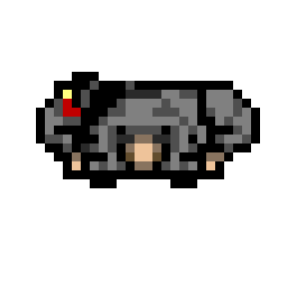

# Case Study: Issue #96 - Add Player Model

## Issue Summary

**Issue URL:** https://github.com/Jhon-Crow/godot-topdown-MVP/issues/96

**Problem Description (Russian):**
> добавить модель игрока
> модель должна состоять из частей для удобства анимации (например анимации перезарядки).
> модель оружия должна быть отдельной моделью, привязанной к винтовке (лучше пока не добавлять модель оружия, чтоб персонаж ходил в позе но с пустыми руками).

**English Translation:**
> Add player model
> The model should consist of parts for easy animation (e.g., reload animations).
> The weapon model should be a separate model attached to the rifle (better not to add the weapon model for now, so the character walks in pose but with empty hands).

## Reference Images Analysis

### Reference 1: Realistic 3D Soldiers (Shutterstock)


- **Style:** Realistic 3D rendered soldiers from bird's-eye view
- **Key Features:**
  - Military tactical gear with backpacks
  - Holding rifles in combat-ready position
  - Strong shadows indicating lighting from above
  - Detailed character models with visible equipment

### Reference 2: Pixel Art Army Man (Shutterstock)


- **Style:** Low-resolution pixel art toy soldier
- **Key Features:**
  - Simple silhouette suitable for 2D games
  - Top-down perspective
  - Blocky/chunky proportions typical of toy soldiers
  - Single static pose holding weapon

## Timeline and Sequence of Events

### Current State Analysis

1. **Current Player Implementation:**
   - Uses `PlaceholderTexture2D` (32x32 blue square)
   - Single `Sprite2D` node for visual representation
   - No modular parts or animations
   - Character is just a colored circle collision shape

2. **Codebase Structure:**
   - `scenes/characters/Player.tscn` - Player scene
   - `scripts/characters/player.gd` - Player controller script
   - `assets/sprites/characters/` - Empty (no character sprites)

3. **Existing Features That Need Visual Integration:**
   - Reload sequence (R-F-R) - needs arm/hand animations
   - Grenade throwing - needs arm movement
   - Shooting - needs weapon aiming visualization
   - Movement - needs direction indication

## Root Cause Analysis

### Why No Player Model Exists

1. **Rapid Prototyping:** The project prioritized gameplay mechanics (shooting, AI, grenades) over visual polish
2. **Placeholder Approach:** Using colored shapes allowed fast iteration on game feel
3. **Art Asset Gap:** No artist contribution yet; all visuals are programmatic or placeholders

### Challenges for Adding Player Model

1. **Modular Design Requirement:** Need separate parts (body, arms, head) for animation
2. **Rotation Handling:** Player rotates to face mouse cursor - sprite must handle this
3. **Animation Integration:** Reload sequence and grenade throw need visual feedback
4. **Art Style Consistency:** Must match the top-down military shooter aesthetic

## Research Findings

### Godot 4 Modular Character Approaches

Based on web research, there are several approaches for creating modular 2D characters in Godot 4:

1. **Multiple Sprite2D Nodes:**
   - Each body part as separate Sprite2D
   - Parent-child hierarchy for attachment
   - AnimationPlayer controls all parts
   - Simple and effective for basic animations

2. **Skeleton2D with Bones:**
   - Uses bone-based rigging system
   - More complex but allows deformation
   - Better for smooth rotations
   - Overkill for simple reload animations

3. **Modular Sprite Animation Factory Plugin:**
   - Godot 4 plugin from Asset Library
   - Generates animations for modular sprites
   - Creates tracks for each Sprite2D node
   - Source: https://github.com/kyboon/ModularSpriteAnimationFactory

### Available Free Assets (CC0)

1. **OpenGameArt.org - Pixel Art Top Down Soldiers:**
   - License: CC0 (Public Domain)
   - Size: 32x32 canvas (64x64 actual spritesheet)
   - Author: tbbk
   - Limitation: No animations, static sprites only
   - Downloaded to: `assets/sprites/characters/soldier*.png`

## Proposed Solution

### Architecture: Multi-Sprite Modular Player

Create a player model using multiple Sprite2D nodes in a parent-child hierarchy:

```
Player (CharacterBody2D)
├── PlayerModel (Node2D) - rotation pivot
│   ├── BodySprite (Sprite2D) - torso/core
│   ├── HeadSprite (Sprite2D) - head/helmet
│   ├── LeftArmSprite (Sprite2D) - left arm
│   ├── RightArmSprite (Sprite2D) - right arm (for reload)
│   └── WeaponMount (Node2D) - weapon attachment point (empty for now)
├── CollisionShape2D
├── Camera2D
├── HitArea
└── ThreatSphere
```

### Implementation Plan

#### Phase 1: Create Base Sprites
1. Create simple pixel art sprites for body parts in top-down view
2. Use a military/tactical style matching references
3. Each part: 16x16 or 32x32 pixels
4. Color palette: greens, browns, grays (military)

#### Phase 2: Update Player Scene
1. Replace single Sprite2D with PlayerModel structure
2. Add Node2D pivot for rotation
3. Position body parts correctly
4. Set z-index for proper layering

#### Phase 3: Animation Setup
1. Create AnimationPlayer node
2. Add idle animation (subtle movement)
3. Prepare for future reload animation
4. Prepare for future throw animation

### Sprite Design Specifications

Based on reference images:

**Top-Down View Requirements:**
- Player viewed from above (bird's-eye)
- Head/helmet visible at center-top
- Shoulders visible on sides
- Arms positioned for weapon hold
- Compact silhouette for 2D gameplay

**Size:** 32x32 pixels per assembled character (body parts smaller)

**Style:** Low-poly pixel art matching reference-2 aesthetic

## Alternative Solutions Considered

### Option A: Single Animated Sprite
- **Pros:** Simpler, less scene tree complexity
- **Cons:** Can't animate parts independently, harder to add reload animation
- **Rejected:** Doesn't meet modular requirement

### Option B: Skeleton2D Rig
- **Pros:** Professional-grade animation, smooth deformation
- **Cons:** Complex setup, requires artist expertise, overkill for this project
- **Rejected:** Too complex for MVP stage

### Option C: Pre-made Asset Pack (Commercial)
- **Pros:** Professional quality, ready to use
- **Cons:** Cost, license restrictions, may not fit art style
- **Rejected:** Project should use free/open assets

## Success Criteria

1. Player has visible sprite (not placeholder)
2. Sprite consists of separate parts (body, head, arms)
3. Parts are positioned correctly for top-down view
4. Sprite rotates smoothly with player direction
5. Architecture ready for future animations
6. No weapon model (as per requirements)
7. CC0 or compatible license for all assets

## Bug Report: Player Model Not Displaying (C# Version)

### Problem Description
After the initial implementation, the user reported that the player model was not displaying correctly:

> "модель не добавилась игроку (возможно из-за C# или импорта)"
> Translation: "the model was not added to the player (possibly due to C# or import)"

### Root Cause Analysis

Upon investigation of the attached game log (`game_log_20260122_025053.txt`), it was discovered that:

1. **Two Player Scenes Exist:**
   - `scenes/characters/Player.tscn` - GDScript version (updated with modular sprites)
   - `scenes/characters/csharp/Player.tscn` - C# version (still using placeholder)

2. **All Levels Use C# Version:**
   - `scenes/levels/TestTier.tscn`
   - `scenes/levels/csharp/TestTier.tscn`
   - `scenes/levels/BuildingLevel.tscn`

   All reference `scenes/characters/csharp/Player.tscn`

3. **C# Scene Was Not Updated:**
   - The GDScript Player.tscn was correctly updated with modular sprites
   - The C# Player.tscn still had:
     - `PlaceholderTexture2D` instead of real textures
     - Single `Sprite2D` node instead of `PlayerModel` hierarchy
     - Old node structure incompatible with new sprites

4. **C# Script Was Not Updated:**
   - `Scripts/Characters/Player.cs` expected single `Sprite2D` node
   - No code to reference or colorize multiple sprite parts

### Fix Applied

1. **Updated `scenes/characters/csharp/Player.tscn`:**
   - Added `PlayerModel` Node2D container
   - Added `Body`, `Head`, `LeftArm`, `RightArm` Sprite2D nodes
   - Added `WeaponMount` Node2D for future weapon attachment
   - Referenced the new player sprite textures

2. **Updated `Scripts/Characters/Player.cs`:**
   - Added references to all sprite parts (`_bodySprite`, `_headSprite`, `_leftArmSprite`, `_rightArmSprite`)
   - Added `SetAllSpritesModulate()` method to apply colors to all parts
   - Updated `UpdateHealthVisual()` to use the new method
   - Updated `ShowHitFlash()` to use the new method
   - Maintained backward compatibility for old single-sprite structure

### Lesson Learned

When implementing visual changes in a dual-language project (GDScript + C#), **both versions must be updated**. The game log showed C# signals being used, indicating the C# version was active, while the visual fix was only applied to the GDScript version.

## Files Changed/Created

- `scenes/characters/Player.tscn` - Updated with modular structure (GDScript version)
- `scenes/characters/csharp/Player.tscn` - Updated with modular structure (C# version)
- `Scripts/Characters/Player.cs` - Updated to support multiple sprite parts
- `assets/sprites/characters/player/` - New sprite files
- `docs/case-studies/issue-96/` - This documentation
- `docs/case-studies/issue-96/logs/` - User-provided game logs

## Sources and References

1. [Godot 2D Sprite Animation Documentation](https://docs.godotengine.org/en/stable/tutorials/2d/2d_sprite_animation.html)
2. [OpenGameArt - Pixel Art Top Down Soldiers (CC0)](https://opengameart.org/content/pixel-art-top-down-soldiers)
3. [Modular Sprite Animation Factory Plugin](https://godotengine.org/asset-library/asset/2701)
4. [Godot Forum - Help animating 2D body parts](https://forum.godotengine.org/t/help-animating-2d-body-parts-multiple-sprite-components/37840)
5. [CraftPix - Top Down Soldier Sprites](https://craftpix.net/product/top-down-soldier-sprites-pixel-art/)
